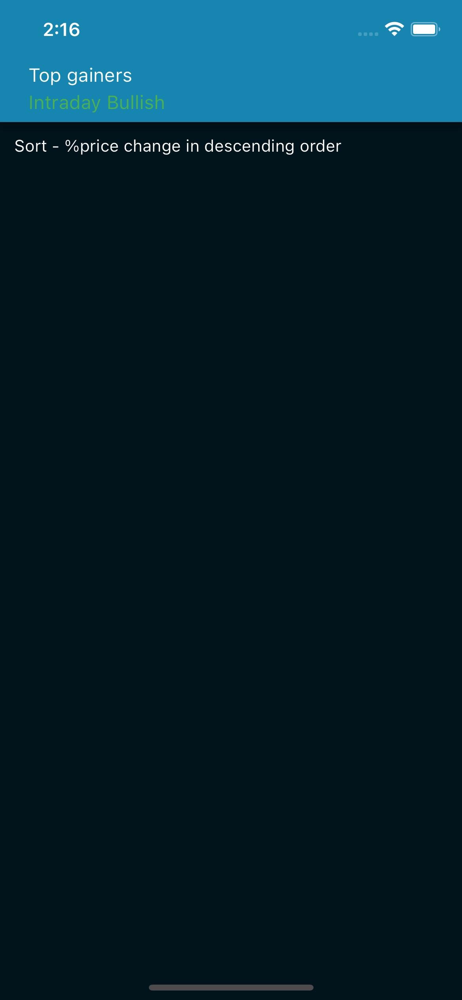

# fit-page-stock-scan

## UI Reference

For the UI design, you can refer to the live demo at [http://coding-assignment.bombayrunning.com/](http://coding-assignment.bombayrunning.com/).

## API Reference

You can fetch data for your project from the provided API endpoint: [http://coding-assignment.bombayrunning.com/data.json](http://coding-assignment.bombayrunning.com/data.json).

## Screenshots

   

    

